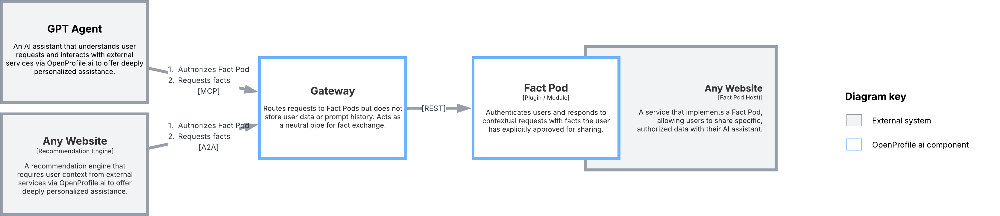
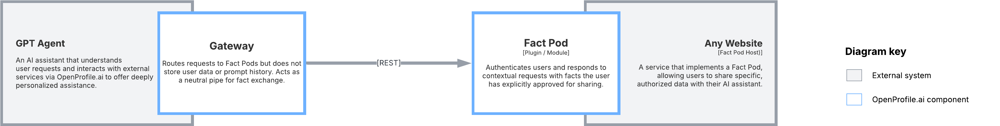

# Architecture Overview

OpenProfile.ai is a modular framework designed to enable AI agents and websites to securely access user-owned data for delivering deeply personalized experiences.
The modular design allows OpenProfile.ai to be integrated into diverse systems, from standalone AI agents to embedded components within websites or applications.
The architecture is built around two core components:

*this diagram shows how a standalone Gateway interacts with Fact Pods and external systems to retrieve user-approved facts.

1. **Gateway**: A stateless intermediary that handles authentication, fact requests, and secure communication between AI agents/websites and data sources.
2. **Fact Pod**: A plugin or module hosted by websites or services that own user data. It authenticates requests, verifies user consent, and provides facts in a standardized format.

The architecture prioritizes **security**, **privacy**, and **interoperability**, ensuring that user data is accessed only with explicit permission and is never stored by the Gateway. By leveraging open standards like OAuth and Schema.org, OpenProfile.ai ensures compatibility across diverse systems and platforms.

---

# Scope

OpenProfile.ai provides both a **specification** and **ready-to-use plugins** to simplify adoption for developers and businesses. The scope includes:

### 1. **Specification**
The OpenProfile.ai specification defines the foundational standards and protocols that enable secure and interoperable communication between Gateways and Fact Pods. Key elements include:

- **`.well-known/openprofile.json` File**:  
  A standardized metadata file hosted by Fact Pods that defines their capabilities, including supported fact categories, OAuth endpoints, and scopes. This file enables Gateways to dynamically discover and interact with Fact Pods.

- **OAuth-Based Client Registration and Authentication**:  
  Secure communication between Gateways and Fact Pods is established using OAuth-based flows, including client registration and token exchange. This ensures that only authorized Gateways can request facts from Fact Pods, with explicit user consent.

- **Facts Retrieval Flow**:  
  A standardized process for securely exchanging user-approved data between Gateways and Fact Pods. This ensures that facts are returned in a consistent format using Schema.org notation, enabling seamless integration across diverse systems.

### 2. **Fact Pod Plugins**
To accelerate adoption, OpenProfile.ai offers pre-built Fact Pod plugins for popular platforms, including:
- **WordPress**: ([WIP](https://github.com/openprofile-ai/wordpress-fact-pod)) A plugin that allows WordPress websites to securely expose user data (e.g., purchase history, wishlists) via OpenProfile.ai.
- **Joomla**: (TBD) A module for Joomla-based websites to act as Fact Pods, enabling secure fact retrieval.
- **Shopify**: (TBD) A Fact Pod integration for Shopify stores to share user data like order history and preferences.
- **Magento**: (TBD) A plugin for Magento eCommerce platforms to expose user data securely.

> These plugins are designed to be easy to install and configure, enabling businesses to quickly integrate OpenProfile.ai functionality without extensive development effort.

---

# Participants

OpenProfile.ai relies on two primary participants to enable secure and personalized data exchange: the **Gateway** and the **Fact Pod**. Each participant plays a distinct role in the architecture, ensuring seamless communication, user consent, and data privacy.

## 1. **Gateway**

The **Gateway** acts as a secure intermediary between the AI agent (e.g., an LLM) or website and external data sources (Fact Pods). It is responsible for orchestrating fact requests, managing authentication, and ensuring secure communication. The Gateway is designed to be flexible and can operate in various configurations:

*example of architecture with embedded Gateway

### Key Features of the Gateway

- **Standalone or Embedded**:  
  The Gateway can function as:
    - A **standalone service** that connects to an LLM or website.
    - An **embedded component** within an LLM or website to boost recommendation engines or other features requiring user context from external services.

> For instance, a standalone Gateway could be deployed as a microservice to support multiple AI agents, while an embedded Gateway could be integrated directly into a website's recommendation engine to provide personalized suggestions.

- **Protocol Support**:  
  The Gateway communicates with LLMs or websites using:
    - **MCP Protocol** ([Model Context Protocol](https://modelcontextprotocol.io))  
      A protocol for securely exchanging context between LLMs and external systems.
    - **A2A Protocol** ([Agent-to-Agent Protocol](https://example.com/a2a-protocol))  
      A protocol for direct communication between agents.

> MCP Protocol enables secure context exchange between LLMs and external systems, while A2A Protocol facilitates direct communication between agents in a decentralized environment.

- **OAuth 2.0 Authentication**:  
  The Gateway supports OAuth 2.0 for secure authentication with LLMs or websites. This ensures that only authorized agents can interact with the Gateway.

- **Proxy Design**:  
  The Gateway is designed as a **stateless proxy**:
    - **Facts are not stored** on the Gateway.
    - It acts as a secure conduit for retrieving facts from Fact Pods and delivering them to the LLM or website.

- **Support for Multiple Fact Pods**:  
  The Gateway can connect to and manage multiple Fact Pods simultaneously, enabling it to aggregate facts from various sources.

- **Fact Pod Discovery and Querying**:  
  When a user sends a prompt to the LLM, the Gateway can:
    - Suggest all available Fact Pod categories to the LLM.
    - Allow the LLM to decide which facts to query based on the user’s request.

- **OAuth Token Management**:  
  The Gateway stores user authorization with Fact Pods and can:
    - Retrieve new access tokens using the **OAuth refresh token flow** when existing tokens expire.

## 2. **Fact Pod**

The **Fact Pod** is a data provider hosted by a website or service that owns user data. It is responsible for securely exposing user-approved facts to Gateways while ensuring user consent and privacy. Fact Pods are the backbone of OpenProfile.ai’s decentralized architecture.

### Key Features of the Fact Pod

- **HTTP-Based Communication**:  
  Fact Pods operate over HTTP, making them lightweight and easy to integrate with existing systems. HTTP is lightweight, widely supported, and enables easy integration with existing web infrastructure."

- **`.well-known/openprofile.json` File**:  
  Each Fact Pod must provide a standardized metadata file at the endpoint:  
  `/.well-known/openprofile.json`  
  This file includes:
    - The **OpenProfile.ai version** supported by the Fact Pod.
    - **OAuth endpoints** for dynamic client registration, authentication and token exchange.
    - A **Schema.org-like description** of the Fact Pod, including the fact categories it supports.

> This metadata file is critical for enabling Gateways to dynamically discover Fact Pods and their capabilities, ensuring seamless integration across diverse systems.

- **OAuth Flow with Add-Ons**:  
  Fact Pods must implement OAuth 2.0 authentication with additional extensions, including:
    - **RFC 7591** ([OAuth 2.0 Dynamic Client Registration Protocol](https://datatracker.ietf.org/doc/html/rfc7591))  
      Enables Gateways to dynamically register as clients with the Fact Pod.
    - **OpenID Connect Discovery** ([OIDC Discovery 1.0](https://openid.net/specs/openid-connect-discovery-1_0.html))  
      Provides a mechanism for Gateways to discover OAuth endpoints and other metadata.

> These extensions enhance the standard OAuth flow by enabling dynamic client registration and metadata discovery, ensuring secure and scalable communication between Gateways and Fact Pods.

- **User Consent and Control**:  
  Fact Pods must prioritize user control over their data:
    - Users must be able to **choose which data categories** (e.g., purchase history, wishlists) to share with the LLM.
    - Users must have the ability to **revoke access** to their data at any time.

> When users revoke access, the Fact Pod immediately invalidates the associated tokens, ensuring that no further data can be retrieved without renewed consent.

---
