# Enable Fact Pod Flow

The **Enable Fact Pod Flow** describes how a user connects a Fact Pod (e.g., `Site.com`) to OpenProfile.ai so their AI Assistant can securely access **user‑approved data** from that site.

This is a **secure OAuth 2.0–based process** that ensures the user has full control over what is shared.

## Sequence Overview

```mermaid
---
config:
  look: neo
  theme: redux
---
sequenceDiagram
    actor User
    participant LLM as AI Assistant
    participant Gateway as Gateway<br>[OpenProfile]
    participant FactPod as Site.com<br>[OpenProfile Fact Pod]

    %% Step 1 — User requests enabling
    User->>LLM: "Enable Fact Pod for Site.com"

    %% Step 2 — LLM triggers enable process
    LLM->>Gateway: (1) enableFactPod(site)

    %% Step 3 — Gateway performs checks
    Gateway->>FactPod: (2) Check OpenProfile compatibility
    Gateway->>FactPod: (3) Register as OAuth client
    FactPod-->>Gateway: (4) OAuth client_id, client_secret, redirect_url

    %% Step 4 — Store config & prepare authorization
    Gateway->>Gateway: Save OAuth client credentials
    Gateway->>Gateway: Generate authorization URL
    Gateway-->>LLM: (5) Return authorization URL
    LLM-->>User: Present authorization link

    %% Step 5 — User authorization with Fact Pod
    User->>FactPod: (6) Authorize & select facts to share
    Note right of FactPod: User logs in and chooses data to share

    %% Step 6 — OAuth callback
    FactPod-->>Gateway: (7) Redirect with authorization code
    Gateway->>FactPod: (8) Exchange code for access/refresh tokens
    FactPod-->>Gateway: (9) Return tokens
    Gateway->>Gateway: Store tokens securely

    %% Step 7 — Completion
    Gateway-->>LLM: (10) Notify activation success
```

## Step-by-Step Description

### **1. User Initiates Request**
- **User → LLM** — The user instructs the AI Assistant to connect a Fact Pod (e.g.,
  > "Enable Fact Pod for Site.com"
- **LLM → Gateway (1)** — The request is passed on to the OpenProfile Gateway for processing.

### **2. Compatibility Check**
- **Gateway → FactPod (2)** — The Gateway queries the Fact Pod’s **`.well-known/openprofile.json`**.
- This file declares:
    - OAuth endpoints
    - Supported scopes & categories
    - Metadata about available data types
- ❌ If this file is missing or invalid, the process stops here.

### **3. Dynamic OAuth Client Registration**
- **Gateway → FactPod (3)** — Registers itself as an OAuth client using the Fact Pod’s **registration endpoint**.
- **FactPod → Gateway (4)** — Returns:
    - **client_id** — unique identifier for the Gateway
    - **client_secret** — secret for secure communication
    - **redirect_url** — callback path for OAuth flow
- These credentials are **stored securely** and never exposed outside the Gateway.

### **4. Generate Authorization Link**
- **Gateway → Gateway** — Creates a personalized authorization URL using the issued client credentials.
- **Gateway → LLM (5)** — Sends the URL to the AI Assistant.
- **LLM → User** — Presents the link to the user.

### **5. User Consent on Fact Pod**
- **User → FactPod (6)** — The user clicks the link, logs into the Fact Pod, reviews requested fact categories, and approves or rejects sharing.
- Only categories explicitly approved here will be retrievable later.

### **6. OAuth Authorization Code Exchange**
- **FactPod → Gateway (7)** — After consent, the Fact Pod redirects to the Gateway with an **authorization code**.
- **Gateway → FactPod (8)** — Exchanges the authorization code for:
    - **Access Token** — short‑lived token for requesting facts
    - **Refresh Token** — to refresh the access token without user re‑login
- **FactPod → Gateway (9)** — Returns the tokens.
- **Gateway → Gateway** — Stores tokens securely — never shared with the LLM.

### **7. Confirmation**
- **Gateway → LLM (10)** — Confirms that the Fact Pod is now enabled and ready to serve fact requests.

## 🔐 Key Security Points
- **Explicit user control** — The user chooses exactly which data categories to share.
- **Standards-based** — Uses OAuth 2.0 with Dynamic Client Registration (RFC 7591).
- **Token confidentiality** — Tokens are stored only in the Gateway.
- **No silent permissions** — Access is impossible without user approval.

---
