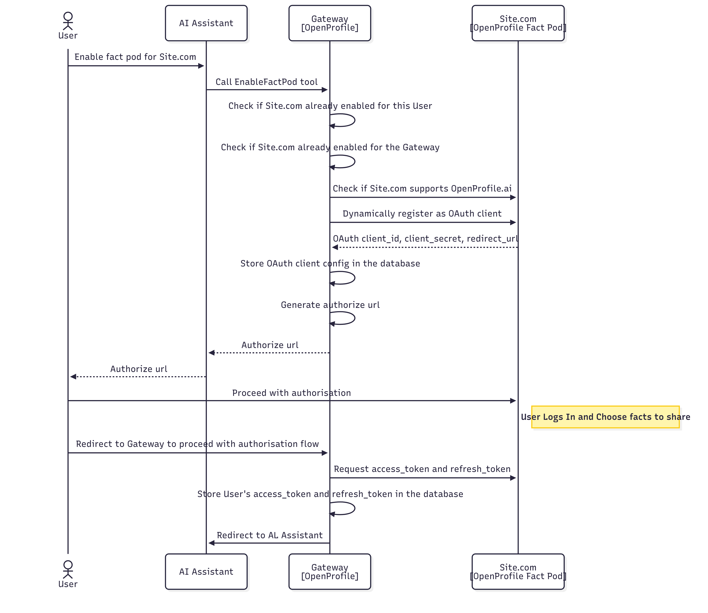

# Enable Fact Pod Flow

The **Enable Fact Pod Flow** outlines the process of connecting a Fact Pod for a specific website (e.g., Site.com) to OpenProfile.ai. This process allows the user to grant permission for the AI Assistant (LLM) to access user-approved data from the website securely. The flow begins with the user’s request to enable the Fact Pod, which is handled by the Gateway.

The Gateway first checks whether the Fact Pod is already enabled for the user and itself. If not, it verifies that the website supports OpenProfile.ai by querying its `.well-known/openprofile.json` endpoint. Once confirmed, the Gateway dynamically registers itself as an OAuth client with the Fact Pod. The Fact Pod responds with the necessary OAuth credentials, which the Gateway securely stores. Finally, the Gateway generates an authorization URL and sends it back to the AI Assistant, which forwards it to the user. The user completes the process by proceeding with authorization on the website.



---

## Key Steps

### 1. Check if Site.com Supports OpenProfile.ai

The Gateway verifies whether the website supports OpenProfile.ai by querying the `.well-known/openprofile.json` endpoint. This endpoint must comply with the [OpenID Connect Discovery Specification](https://openid.net/specs/openid-connect-discovery-1_0.html). The response from this endpoint provides essential metadata about the Fact Pod, including supported OAuth endpoints, scopes, and fact categories.

The `.well-known/openprofile.json` endpoint **must** return the following structure:

```json
{
    "issuer": "https://someshop.online",
    "authorization_endpoint": "https://someshop.online/openprofile/oauth/authorize",
    "token_endpoint": "https://someshop.online/openprofile/oauth/access_token",
    "registration_endpoint": "https://someshop.online/openprofile/oauth/register",
    "jwks_uri": "https://someshop.online/.well-known/openprofile-jwks.json",
    "response_types_supported": [
        "code"
    ],
    "grant_types_supported": [
        "authorization_code",
        "refresh_token"
    ],
    "token_endpoint_auth_methods_supported": [
        "client_secret_basic",
        "client_secret_post"
    ],
    "scopes_supported": [
        "facts:category-16",
        "facts:category-18",
        "facts:wishlist"
    ]
}
```

#### Important Fields

| Field                                   | Description                                                                                      |
|-----------------------------------------|--------------------------------------------------------------------------------------------------|
| `issuer`                                | The base URL of your WordPress site, used to identify the token issuer                           |
| `authorization_endpoint`                | The URL where users are redirected to authorize client applications                              |
| `token_endpoint`                        | The URL where client applications can exchange authorization codes for access tokens             |
| `registration_endpoint`                 | The URL where new client applications can register                                               |
| `jwks_uri`                              | The URL to the JSON Web Key Set (JWKS) containing the public keys used to verify tokens          |
| `response_types_supported`              | The OAuth 2.0 response types supported by this server (e.g., "code")                             |
| `grant_types_supported`                 | The OAuth 2.0 grant types supported by this server (e.g., "authorization_code", "refresh_token") |
| `token_endpoint_auth_methods_supported` | Authentication methods supported at the token endpoint                                           |
| `scopes_supported`                      | List of OAuth scopes supported by this server                                                    |

> .well-known/openprofile-jwks.json: This file contains the JSON Web Key Set (JWKS) with the public key information used to verify the signatures of JSON Web Tokens (JWTs) issued by your server.

---

### 2. Dynamically Register as OAuth Client

Using the `registration_endpoint` and `scopes_supported` provided in the `.well-known/openprofile.json` file, the Gateway dynamically registers itself as an OAuth client with the Fact Pod. This step follows the [OAuth 2.0 Dynamic Client Registration Protocol](https://datatracker.ietf.org/doc/html/rfc7591), ensuring secure and standardized client registration.

Example request and response for dynamic client registration:

```
POST https://someshop.online/openprofile/oauth/register
Content-Type: application/x-www-form-urlencoded

name=My%20Application&
redirect_uri=https://example.com/callback&
grant_types=authorization_code%20refresh_token
```

#### Request Parameters

| Parameter      | Required    | Description                                                                  |
|----------------|-------------|------------------------------------------------------------------------------|
| `name`         | Yes         | A descriptive name for the client application                                |
| `redirect_uri` | Yes         | The URI to redirect to after authorization is complete (must be a valid URL) |
| `grant_types`  | Recommended | authorization_code refresh_token                                             |

#### Example Response

```json
{
  "client_id": "550e8400-e29b-41d4-a716-446655440000",
  "client_secret": "random_generated_secret_that_you_must_store",
  "name": "My Application",
  "redirect_uri": "https://example.com/callback",
  "grant_types": "authorization_code refresh_token"
}
```

> **Important**: The `client_secret` is only returned once during registration. Make sure to store it securely as it cannot be retrieved later.

---

### 3. Generate Authorization URL

Once the Gateway is registered as an OAuth client, it generates an authorization URL to initiate the OAuth flow. This URL is sent back to the AI Assistant, which forwards it to the user. The user uses this URL to complete the authorization process on the website, granting permission for the Gateway to access user-approved data.

Example of an authorization URL:

```
https://someshop.online/openprofile/oauth/authorize?
    response_type=code &
    client_id=550e8400-e29b-41d4-a716-446655440000 &
    redirect_uri=https://example.com/callback &
    scope=facts:category-16%20facts:category-18%20facts:wishlist &
    state=abc123xyz
```

#### Request Parameters

| Parameter       | Required    | Description                                                                            |
|-----------------|-------------|----------------------------------------------------------------------------------------|
| `response_type` | Yes         | Must be set to `code` for the authorization code flow                                  |
| `client_id`     | Yes         | The client identifier issued to the client during registration                         |
| `redirect_uri`  | Yes         | The URI to redirect to after authorization is complete (must match the registered URI) |
| `scope`         | Yes         | Space-separated list of scopes the client is requesting access to                      |
| `state`         | Recommended | An opaque value used by the client to maintain state between the request and callback  |

---

### 4. Redirect to Gateway to proceed with authorisation flow

Once the user clicks the authorization URL provided by the Gateway, they are redirected to the Fact Pod’s authorization endpoint. Here, the user reviews the requested scopes and data categories and explicitly grants or denies access. Upon successful authorization, the Fact Pod redirects the user back to the Gateway using the redirect_url provided during the OAuth client registration process. This redirection includes an authorization code that the Gateway will use to complete the OAuth flow.

### 5. Request access_token and refresh_token

After receiving the authorization code from the Fact Pod, the Gateway initiates a token exchange process by making a request to the Fact Pod’s token_endpoint. This step follows the standard OAuth 2.0 flow, where the authorization code is exchanged for an access_token and a refresh_token. The access_token allows the Gateway to retrieve facts from the Fact Pod, while the refresh_token enables the Gateway to renew the access_token when it expires, ensuring uninterrupted access.

Example request and response for access_token:


```
POST https://someshop.online/openprofile/oauth/access_token
Content-Type: application/x-www-form-urlencoded

grant_type=authorization_code &
client_id=550e8400-e29b-41d4-a716-446655440000 &
client_secret=SECRET &
redirect_uri=https://gateway.openprofile.ai/oauth/callback &
code=def502003d0e1b9b6
```

#### Request Parameters

| Parameter       | Required | Description                                                                      |
|-----------------|----------|----------------------------------------------------------------------------------|
| `grant_type`    | Yes      | Must be set to `authorization_code`                                              |
| `client_id`     | Yes      | The client identifier issued to the client during registration                   |
| `client_secret` | Yes      | The client secret issued to the client during registration                       |
| `redirect_uri`  | Yes      | Must be identical to the redirect URI provided in the authorization request      |
| `code`          | Yes      | The authorization code received from the authorization server (as GET parameter) |

#### Example Response

```json
{
  "token_type": "Bearer",
  "expires_in": 3600,
  "access_token": "eyJ0eXAiOiJKV1QiLCJhbGciOiJSUzI1NiJ9...",
  "refresh_token": "def502003d0e1b9b6..."
}
```

The Gateway securely stores the tokens and associates them with the user’s session, maintaining compliance with privacy and security standards.

