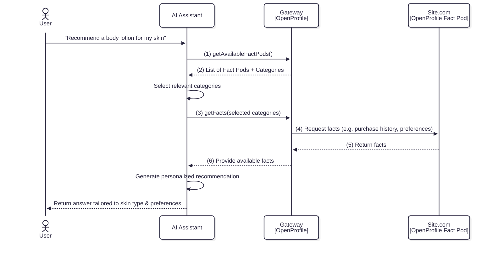

# Get Facts Flow

The **Get Facts Flow** describes how the AI Assistant (LLM), through OpenProfile, retrieves **user‑approved facts** from connected Fact Pods to deliver more accurate, context‑aware responses.

This flow happens **after the user has already enabled** one or more Fact Pods (see “Enable Fact Pod Flow”).

## Sequence Overview

## Step-by-Step Description

### **1. User Makes a Request**
- The user asks the LLM for help, e.g.,
  > "Recommend a body lotion for my skin"
- The AI Assistant may need additional **user-specific context** (such as skin type, past purchases, or brand preferences) to answer meaningfully.

### **2. Get List of Enabled Fact Pods**
- **LLM → Gateway (1)** — The LLM asks the Gateway for a list of Fact Pods the user has already connected and authorized.
- **Gateway → LLM (2)** — Returns:
    - Fact Pod names and descriptions
    - Available fact categories (e.g., *Purchase History*, *Wishlist*, *Profile Data*)
    - Metadata describing what each fact category represents

**Why important:** This step lets the LLM know what **context sources** are available without directly accessing sensitive data yet.

### **3. Select Relevant Categories & Request Facts**
- **LLM → LLM:** The AI internally decides what fact categories could improve the answer (e.g., *skincare purchase history*, *skin condition preferences*).
- **LLM → Gateway (3)** — Requests facts for the selected categories.
- The Gateway handles secure retrieval — the LLM never directly connects to Fact Pods.

### **4. Gateway Retrieves Facts from Fact Pods**
- **Gateway → FactPod (4)** — The Gateway sends a facts request to the relevant Fact Pod(s).  
  Only categories the user has already authorized are included.
- **FactPod → Gateway (5)** — The Fact Pod returns the facts. Example:
    - Previous purchases containing aloe vera
    - Recorded preference: "Sensitive skin"
    - Wishlist skin products

Tokens obtained during the **Enable Fact Pod Flow** are used here to authenticate securely.

### **5. Gateway Delivers Facts to LLM**
- **Gateway → LLM (6)** — Sends back the retrieved facts in a structured format.
- No raw API secrets or tokens are exposed to the LLM.

### **6. LLM Generates Personalized Answer**
- Using the provided facts, the LLM tailors its response:
    - Recognizes user’s purchase history suggests **fragrance-free** products
    - Aligns brand recommendations to wishlist
    - Filters for sensitive skin products
- **LLM → User:** Returns a highly personalized recommendation.

## Key Privacy & Trust Principles
- **User consent is respected** — only authorized categories are accessed.
- **Secure token handling** — LLM never holds tokens; the Gateway manages authentication.
- **Minimum necessary data** — only facts relevant to the request are fetched.
- **No data persistence in LLM** (beyond the current conversation context).

## OpenAPI
Please find all needed contracts in the [fact-pod.yaml](../openapi/fact-pod.yaml)

---
